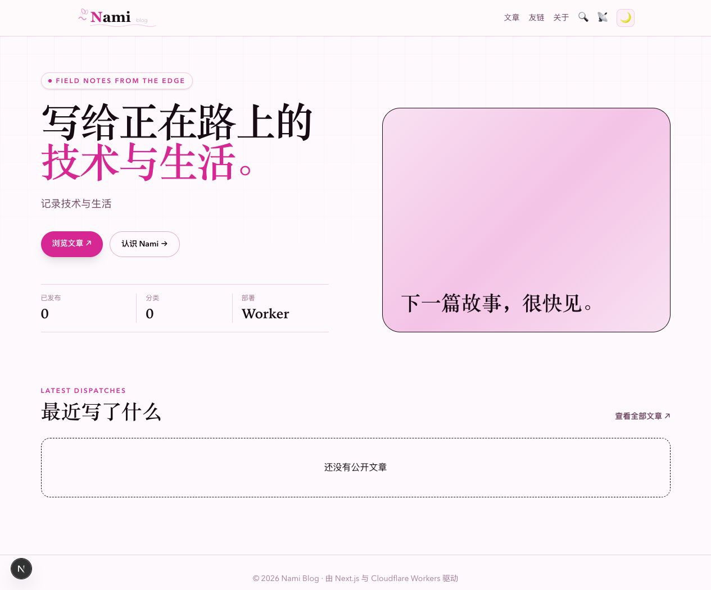
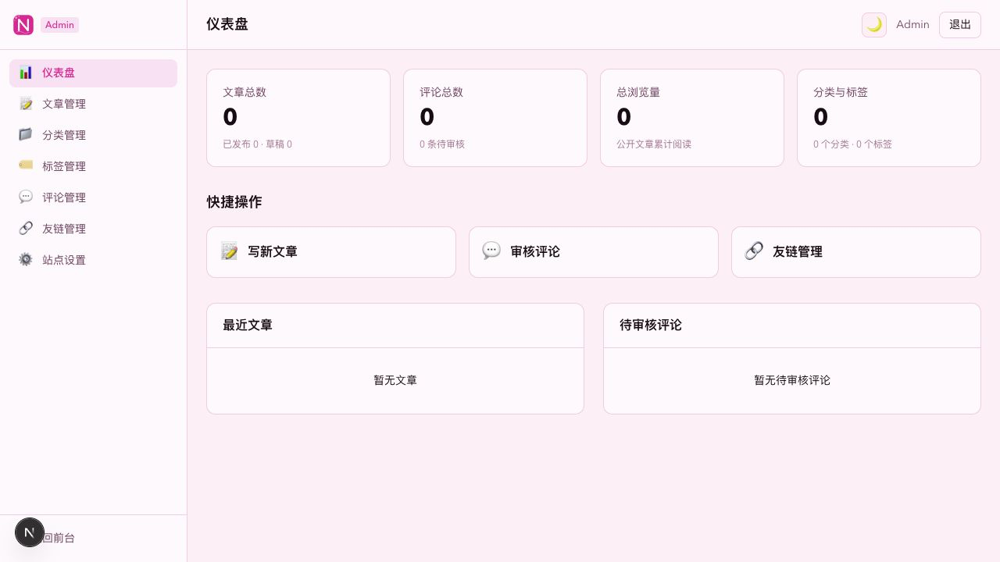

<p align="center">
  
</p>

<h1 align="center">Nami 娜美博客</h1>

<p align="center">
  <strong>Cloudflare 原生 · 零服务器成本 · 二次元风格个人博客系统</strong>
</p>

<p align="center">
  <a href="#-快速开始">快速开始</a> •
  <a href="#-截图">截图</a> •
  <a href="#-主题系统">主题</a> •
  <a href="#-文档">文档</a>
</p>

<p align="center">
  
  
  
  
  <a href="https://github.com/elite-silab/nami-blog/actions/workflows/ci.yml"></a>
  
</p>

## ✨ 为什么选择 Nami Blog？

| 特性              |    Nami Blog     | WordPress |    Ghost     | Hexo / Hugo |
| :---------------- | :--------------: | :-------: | :----------: | :---------: |
| **需要服务器**    |    ❌ 不需要     |  ✅ 需要  |   ✅ 需要    |  ❌ 不需要  |
| **运行成本**      | $0（CF 免费版）  | VPS 费用  |  VPS / $9+   |     $0      |
| **全球 CDN 加速** |   ✅ 边缘节点    | ❌ 需配置 |  ❌ 需配置   | 取决于托管  |
| **管理后台**      |     ✅ 内置      |  ✅ 内置  |   ✅ 内置    |    ❌ 无    |
| **评论系统**      |     ✅ 自建      |   插件    |     付费     |   第三方    |
| **主题系统**      | 3 套 + Dark 模式 | 海量主题  |   少量主题   |  海量主题   |
| **SEO / RSS**     |     ✅ 内置      |   插件    |   ✅ 内置    |   ✅ 内置   |
| **数据库**        |  D1（全球分布）  |   MySQL   | MySQL/SQLite |     无      |

> **核心差异**：传统博客要么需要 VPS（WordPress/Ghost），要么没有管理后台（Hexo/Hugo）。Nami Blog 的控制面完全运行在 Cloudflare 边缘网络上——D1 数据库、Workers API、Pages 前端——全部免费，自带完整管理后台。

## 🚀 特性一览

- 🌸 **三套二次元主题** — 樱花 / 海洋 / 星空，管理后台一键切换，独立 Dark 模式
- ⚡ **边缘渲染** — Astro SSG 静态生成 + Cloudflare CDN 全球分发，毫秒级响应
- 💬 **自建评论系统** — 嵌套回复、敏感词过滤、管理员审核，无第三方依赖
- 🔐 **可轮换 JWT 会话** — HttpOnly Cookie + 标签页令牌回退
- 📱 **响应式交互** — 阅读进度条、TOC 目录、代码块复制、移动端汉堡菜单
- 📡 **RSS + SEO** — RSS 订阅、Open Graph、Twitter Card、JSON-LD 结构化数据
- 💾 **可视化备份** — 后台一键导出或导入内容数据，无需 Wrangler 命令
- 🩺 **健康检查** — `/healthz` 端点、统一错误响应、公开 API 缓存策略
- ☁️ **Cloudflare 原生** — Workers + D1 + Pages，零服务器运维，全球边缘加速

## 📸 截图

|                        前台首页                        |                      管理后台                       |
| :----------------------------------------------------: | :-------------------------------------------------: |
|  |  |

## 🏗️ 架构

```text
                        ┌──────────────────────────┐
 浏览器 ── Pages ──────▶│ Cloudflare Worker / Hono │
                        │ 鉴权 · 文章 · 评论 · API │
                        └────────────┬─────────────┘
                                     │
                              ┌──────┴──────┐
                              │     D1      │
                              └─────────────┘
                                     ▲
                                     │
                        Astro SSG 静态生成
                        构建时预渲染全部页面
```

- **控制面**（Cloudflare）：Workers 处理 API、D1 存数据、Pages 托管前端
- **前端**（Astro SSG）：构建时预渲染为静态 HTML，Pages CDN 全球分发

## 🛠 技术栈

| 层级     | 技术                      | 说明                                        |
| -------- | ------------------------- | ------------------------------------------- |
| 前端     | **Astro 5**               | Static 模式（SSG），构建时预渲染            |
| API      | **Cloudflare Workers**    | Hono 框架，RESTful API                      |
| 数据库   | **Cloudflare D1**         | SQLite 兼容，边缘分布式                     |
| 样式     | **Tailwind CSS 4**        | CSS-first 配置，CSS 变量主题                |
| 认证     | **JWT** (jose + bcryptjs) | HttpOnly Cookie + Bearer Header             |
| Monorepo | **pnpm workspace**        | `apps/api` + `apps/web` + `packages/shared` |
| 测试     | **Vitest**                | 109 个测试用例，含 Workers 集成测试         |

## 🚀 快速开始

> **你需要**：GitHub 和 Cloudflare 免费账号。不需要域名，Cloudflare 会提供免费的 `workers.dev` 和 `pages.dev` 地址。

### 第一步：Fork 仓库

打开本仓库 → 右上角 **Fork** → **Create fork**

### 第二步：创建 D1 数据库

Cloudflare 控制台 → **Storage & Databases** → **D1** → **Create database**

| 资源      | 名称        | 需要复制    |
| --------- | ----------- | ----------- |
| D1 数据库 | `nami-blog` | Database ID |

### 第三步：填写数据库配置

GitHub 打开 `apps/api/wrangler.toml` → 点铅笔 ✏️ → 先填写第二步复制的 Database ID：

```toml
# 粘贴第二步复制的 Database ID
database_id = "xxxx-xxxx-xxxx-xxxx"
```

此时还不知道最终的前端地址，`CORS_ORIGIN` 先不用改，第六步再按实际地址回填。点 **Commit changes** 保存。

### 第四步：部署 API（Worker）

Workers & Pages → Create → **Import from Git** → 选你 Fork 的仓库，填写：

| 配置项         | 值                                    |
| -------------- | ------------------------------------- |
| Project name   | `nami-blog-api`                       |
| Build command  | `pnpm --filter @nami/api build`       |
| Deploy command | `pnpm --filter @nami/api deploy:full` |
| Node version   | `22`                                  |

点 **Save and Deploy**，部署成功后复制 Worker 地址（如 `https://nami-blog-api.xxx.workers.dev`）。

然后进入 Worker **Settings → Variables and Secrets**，添加 3 个 Secret：

| 变量                     | 值                                                             |
| ------------------------ | -------------------------------------------------------------- |
| `JWT_SECRET`             | 密码管理器生成的随机长字符串                                   |
| `JWT_REFRESH_SECRET`     | 另一个不同的随机长字符串                                       |
| `ADMIN_INITIAL_PASSWORD` | 自己设置的一次性管理员密码，至少 12 个字符，不能使用本地默认值 |

三个值都不要提交到 GitHub，也不要互相复用。保存后再 Deploy 一次 ☕

### 第五步：部署前端（Pages）

Workers & Pages → Create → **Pages** → **Connect to Git** → 选你 Fork 的仓库，填写：

| 配置项                 | 值                              |
| ---------------------- | ------------------------------- |
| Project name           | `nami-blog`                     |
| Build command          | `pnpm --filter @nami/web build` |
| Build output directory | `apps/web/dist`                 |

> 如果页面只有 **Deploy command** 而没有 **Build output directory**，说明进入了 Workers 创建流程；请返回并选择 **Pages → Connect to Git**。

首次部署只添加一个 Environment variable：

| 变量             | 值                                                                         |
| ---------------- | -------------------------------------------------------------------------- |
| `PUBLIC_API_URL` | 第四步复制的完整 Worker 地址，例如 `https://nami-blog-api.xxx.workers.dev` |

此时还没有最终 Pages 地址，`SITE_URL` 先不填写。点 **Save and Deploy** 完成第一次部署 ☕

### 第六步：回填正式地址

部署成功后，先确定访客以后真正使用的前端地址：

- 使用 Cloudflare 免费域名：复制实际 Pages 地址，例如 `https://your-project.pages.dev`。
- 已绑定自己的域名：使用自己的正式域名，例如 `https://blog.example.com`，不再使用 `.pages.dev` 地址。

然后完成两处同步：

1. 进入 Pages **Settings → Environment variables**，新增 `SITE_URL`，值填上面确定的完整前端地址，然后重新部署 Pages。
2. 回 GitHub 编辑 `apps/api/wrangler.toml`，把 `CORS_ORIGIN` 改为同一个地址：

```toml
CORS_ORIGIN = "https://your-project.pages.dev"
```

如果使用自定义域名，Pages 环境变量填：

```dotenv
SITE_URL=https://blog.example.com
```

`apps/api/wrangler.toml` 填：

```toml
CORS_ORIGIN = "https://blog.example.com"
```

`SITE_URL` 用于生成 SEO 标准链接、Sitemap、RSS 和分享链接；`CORS_ORIGIN` 用于允许该前端访问 API。两者必须指向实际对外使用的同一个前端域名，不要带页面路径，也不要在末尾加 `/`。Commit 后 Workers 会自动重新部署。

### 第七步：开启内容自动更新

Nami 的前台是静态页面。为了让发布文章、修改分类或保存站点设置后自动更新前台，需要配置一次 Pages Deploy Hook：

1. 进入 Pages 项目 **Settings → Builds & deployments → Deploy hooks**。
2. 点击 **Add deploy hook**，名称填写 `Nami Publish`，分支选择 `main`。
3. 创建后复制 Cloudflare 生成的 Hook URL。
4. 进入 Worker 项目 **Settings → Variables and Secrets**。
5. 新建 Secret，名称填写 `PAGES_DEPLOY_HOOK_URL`，值粘贴刚复制的 Hook URL，然后保存。
6. 重新部署一次 Worker，让新 Secret 生效。

Hook URL 相当于部署密码，只放在 Worker Secret 中，不要写进 GitHub、Pages 环境变量或截图。配置完成后，后台发布公开文章或保存公开设置时会提示“前台正在自动更新”，通常等待 1–2 分钟即可看到结果；草稿和非公开文章不会触发部署。

### 第八步：登录

打开实际 Pages 地址后加 `/admin/login`，例如 `https://nami-blog.pages.dev/admin/login`。

- 用户名：`admin`
- 密码：第四步在 Workers Dashboard 设置的 `ADMIN_INITIAL_PASSWORD`

首次登录只在数据库没有管理员时生效。登录后立即到 **后台设置 → 安全设置** 修改密码，再回 Workers Dashboard 删除 `ADMIN_INITIAL_PASSWORD`；以后修改或删除该 Secret 都不会重置已有账号。生产环境会拒绝公开的本地默认密码 `nami-local-admin`。

> 📖 详细图文见 [Cloudflare 部署指南](docs/Cloudflare部署指南.md) · 本地使用见 [小白上手指南](docs/小白上手指南.md) · 高级运维见 [部署运维文档](docs/部署运维文档.md)

### ✅ 完成

以后每次 push 到 `main`，API 和前端都会自动重新部署；在后台发布公开内容也会自动重建前台，不需要再进入 Cloudflare 手动点击重新部署。

## 💻 本地开发

```bash
git clone https://github.com/你的用户名/nami-blog.git && cd nami-blog
pnpm install && cp .env.example .env
pnpm dev
```

`.env.example` 提供可直接运行的本地默认值；需要自定义时直接编辑生成的 `.env`。上面的复制命令只需在首次安装时执行，已有 `.env` 时不要重复执行，以免覆盖自己的配置。`pnpm dev` 会自动执行本地 D1 migration，不需要单独运行数据库命令。

- 前端：`http://localhost:4322`
- 管理后台：`http://localhost:4322/admin/login`（`admin` / `nami-local-admin`）
- API：`http://localhost:8788`

### 常用命令

```bash
pnpm dev              # 启动 API + Web
pnpm build            # 构建
pnpm test             # 运行测试（109 tests）
pnpm typecheck        # 类型检查
pnpm lint             # ESLint
pnpm db:migrate       # 高级：手动执行本地 D1 迁移
pnpm db:seed          # 高级：交互式创建管理员
pnpm db:reset         # 重置本地数据库
```

## 📦 项目结构

```
apps/
├── api/          # Cloudflare Worker / Hono API
└── web/          # Astro SSG 前端 + 管理后台
packages/
└── shared/       # TypeScript 跨层共享类型
docs/             # 架构、部署、交互文档
migrations/       # D1 数据库迁移 SQL
```

## 🔒 安全

- **JWT 会话**：可轮换 Access + Refresh Token，HttpOnly Cookie 传输
- **密码安全**：bcrypt 哈希存储，管理后台支持修改密码
- **评论审核**：管理员审核制，敏感词自动过滤
- **建议**：管理后台额外使用 Cloudflare Access 保护

## 🎨 主题系统

三套二次元风格主题 + 独立 Dark 模式，CSS 变量实现，管理后台可视化切换：

| 主题           | 风格             | 主色调    |
| -------------- | ---------------- | --------- |
| 🌸 樱花 Sakura | 温柔浪漫，粉色系 | `#ec4899` |
| 🌊 海洋 Ocean  | 清凉通透，蓝绿色 | `#0891b2` |
| ✨ 星空 Starry | 深邃宇宙，紫蓝色 | `#8b5cf6` |

每套主题支持明/暗两种模式，`data-theme` + `data-dark` 属性独立控制，任意组合。

## 📖 文档

| 文档                                              | 说明                   |
| :------------------------------------------------ | :--------------------- |
| [Cloudflare 图文部署](docs/Cloudflare部署指南.md) | Dashboard/Git 集成部署 |
| [部署运维](docs/部署运维文档.md)                  | 生产环境高级运维       |
| [小白上手](docs/小白上手指南.md)                  | 零基础本地启动指南     |
| [前端功能](docs/前端功能与交互设计文档.md)        | 页面结构与交互规范     |
| [管理后台](docs/管理后台功能与设计文档.md)        | 后台功能与安全设计     |
| [Git 规范](docs/Git工作规范.md)                   | 分支模型与提交规范     |

## 🧪 质量

```bash
pnpm test        # Vitest 109 个用例
pnpm typecheck   # TypeScript 类型检查
pnpm lint        # ESLint
pnpm build       # 全量构建
```

## 🤝 参与贡献

欢迎 Issue 和 Pull Request！在提交 PR 前请确保：

- `pnpm test` 全部通过
- 新功能附带对应测试用例（项目遵循 TDD）
- 代码风格与现有项目一致

## 📄 协议

[MIT](LICENSE) — 自由使用、修改和分发。

## ⭐ Star History

如果你喜欢这个项目，请给一个 Star 支持！

[](https://star-history.com/#elite-silab/nami-blog&Date)

---

<p align="center">
  <sub>Built with ❤️ on Cloudflare Workers</sub>
</p>
